# Diabetes Companion

A simple, mobile-friendly app to track **daily tablets** and **meals** for diabetes care.  
Runs on your PC, opens on a phone via **Tailscale** — private, free, and per-user.

<p align="center">
  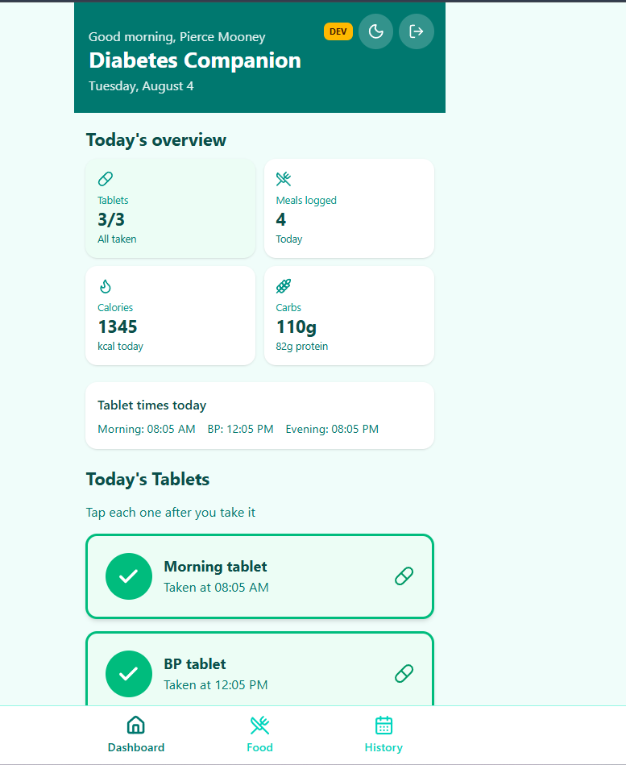
</p>

---

## A day in the app

### 1. Sign in

Each person has their own account. Sign up with email, verify once, then log in. Data stays separate per user.

<p align="center">
  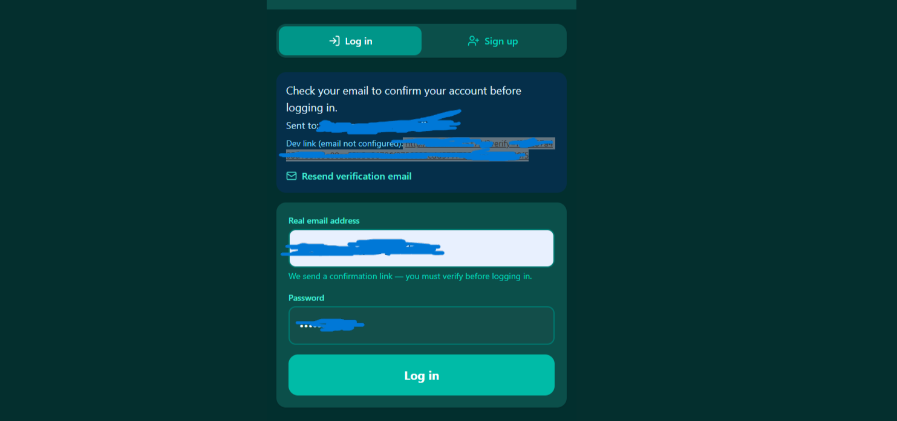
</p>

### 2. Dashboard — today’s overview

See tablets, meals, calories, and carbs at a glance. Weather shows when location is available. Swipe or use the bottom nav to move between Dashboard, Food, and History.

<p align="center">
  
</p>

### 3. Tablets — morning, BP, evening

Big tap targets for three daily slots. Taken times are recorded; missed doses show clearly on Today and in History. Reminder banners appear when a dose is still outstanding.

<p align="center">
  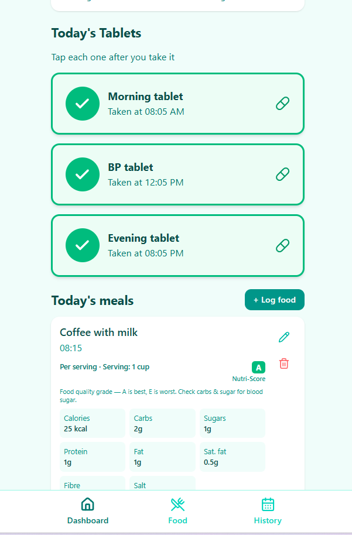
</p>

### 4. Food — quick add & search

Log usual meals in one tap, reuse frequent meals from history, or search packaged foods via Open Food Facts. Nutrition (calories, carbs, sugar, protein, fat, and more) is stored with each meal. Nutri-Score (A–E) appears when available — A is best, E is worst; for diabetes, carbs and sugar matter most.

<p align="center">
  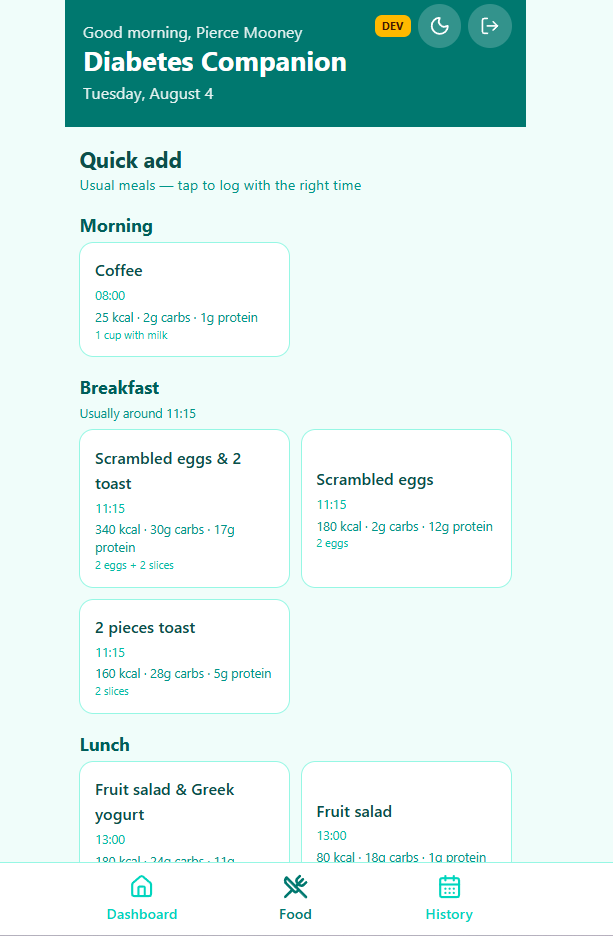
  &nbsp;
  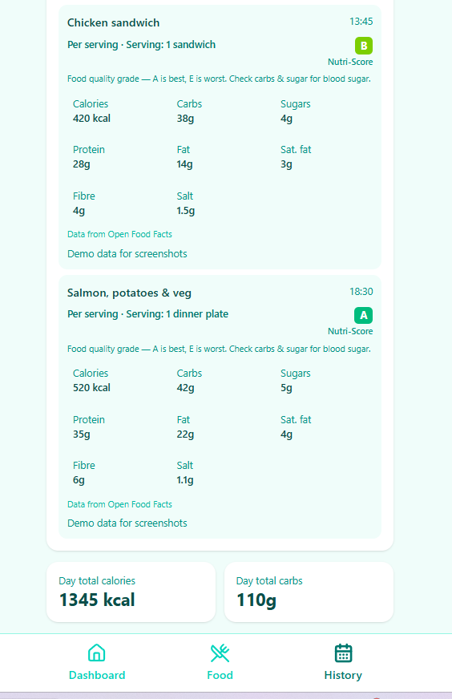
</p>

### 5. Barcode scan

Point the phone camera at a barcode (HTTPS required), or type the numbers. Pulls product nutrition from Open Food Facts when found.

<p align="center">
  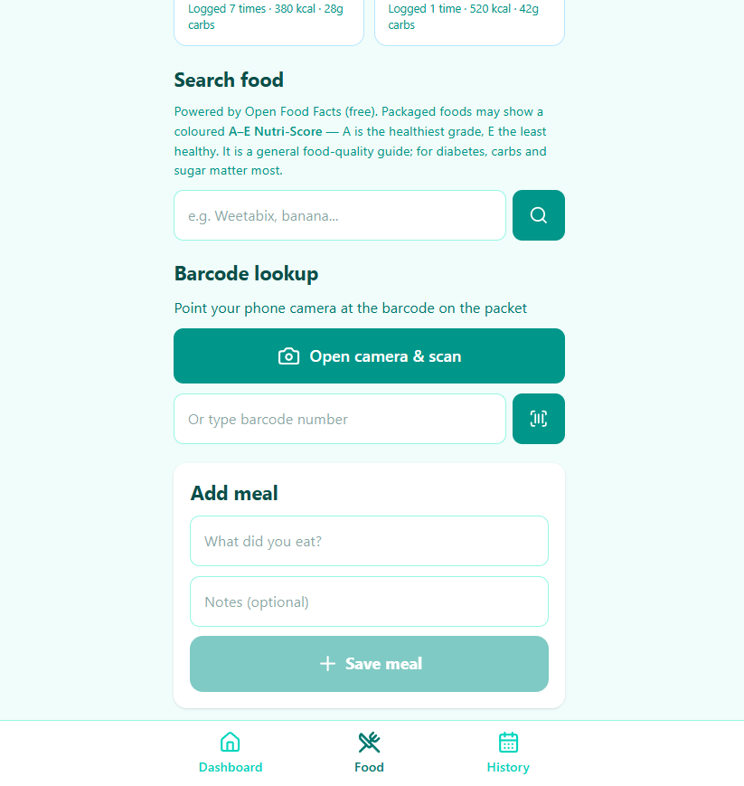
</p>

### 6. History — day, week, 2 weeks, all

Review any day with tablets and meals, jump with the date picker, or switch to week / 2-week / all views for longer summaries (including print on week view).

<p align="center">
  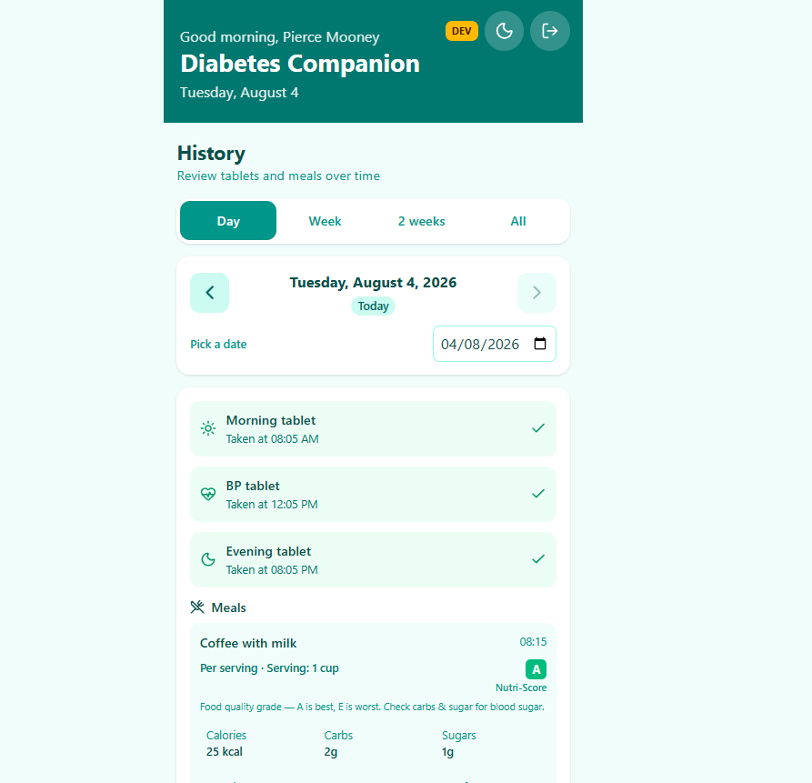
  &nbsp;
  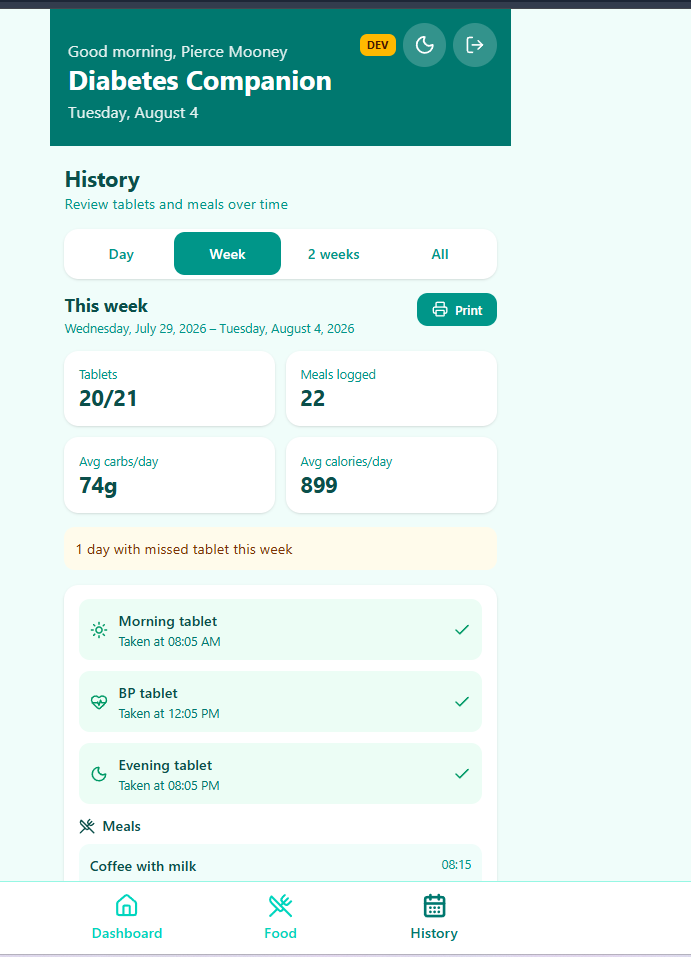
</p>

<p align="center">
  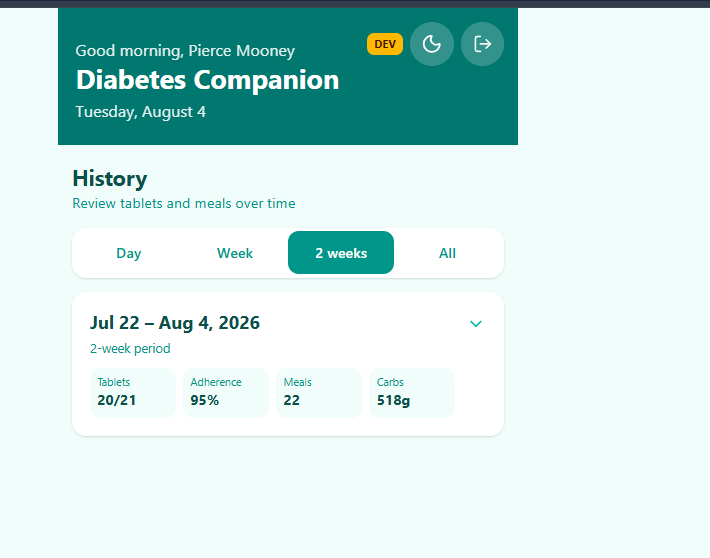
  &nbsp;
  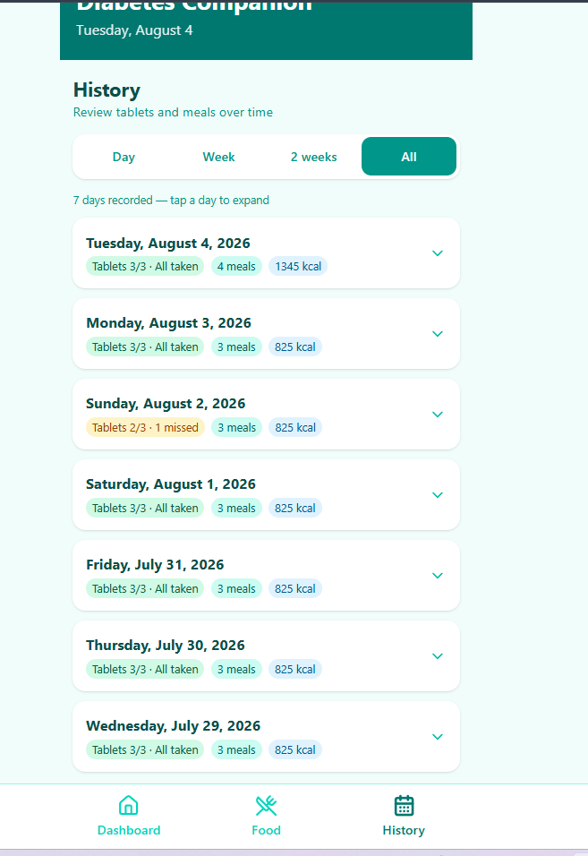
</p>

### 7. Light & dark mode

Tap the sun/moon button in the header to switch themes. Your choice is remembered on the device and synced to your account when you’re logged in.

<p align="center">
  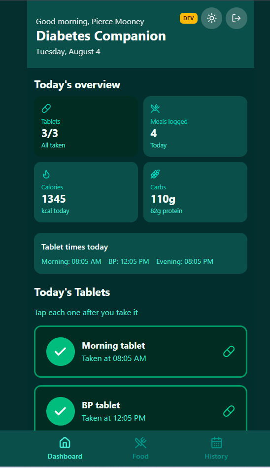
</p>

---

## Features at a glance

- Morning, BP & evening tablet tracking with reminders and missed-dose visibility  
- Quick-add meals, frequent meals, search, barcode, edit & delete  
- Full nutrition + Nutri-Score where available  
- History: day / week / 2 weeks / all  
- Weather, light/dark theme, installable PWA  
- Accounts: sign up, email verify, login, password reset  
- Swipe between tabs on phone  
- Separate **DEV** and **PROD** databases so experiments stay safe  
- Automatic SQLite backups while the server runs  

---

## Requirements

- **Node.js 22.5+** (built-in SQLite)  
- Tailscale on PC and phone (for remote access)  
- Optional: Gmail for verification / password-reset emails  

## Dev vs production

| | **DEV** (safe playground) | **PROD** (live phone app) |
|--|---------------------------|---------------------------|
| Command | `npm run dev` | `npm run build` then `npm start` |
| URL | http://127.0.0.1:5173 | http://localhost:3001 (+ Tailscale) |
| API port | **3002** | **3001** |
| Database | `server/diabetes-dev.db` | `server/diabetes.db` |

`npm run dev` frees ports 3002/5173 first (leaves live **3001** alone). Look for the amber **Dev** badge.

Demo screenshots data (dev only):

```powershell
npm run seed-demo:dev -- you@email.com
```

## Quick start

```powershell
cd C:\Users\pierc\Desktop\DiabetesApp
npm run install:all
npm run setup
npm run dev
```

Open **http://127.0.0.1:5173**.

Production (what Tailscale should use):

```powershell
npm run build
npm start
```

App: **http://localhost:3001**

## Host for phone (Tailscale)

Private network — only your Tailscale devices can reach it.

1. Install Tailscale on PC and phone (same account / sharing)  
2. Phone must appear as a **connected machine**, not only an invited user  
3. On the PC:

```powershell
npm run build
npm start
tailscale serve --bg 3001
```

4. On the phone, open the HTTPS URL Tailscale gives you (e.g. `https://your-pc.tail-xxxx.ts.net`) and **Add to Home Screen**

If port 3001 is busy:

```powershell
netstat -ano | findstr :3001
taskkill /PID <pid> /F
npm start
```

**Camera barcode** needs that **HTTPS** URL.

## Free APIs

| API | Purpose | Key? |
|-----|---------|------|
| [Open Food Facts](https://world.openfoodfacts.org/data) | Food search & barcode | No |
| [Open-Meteo](https://open-meteo.com) | Weather | No |

## Accounts & email

Self-register → verify email → log in. Passwords are hashed. Sessions last 30 days. Forgot-password uses the same Gmail SMTP setup.

```powershell
npm run setup
```

Then set `SMTP_PASS` (Gmail app password) in `server/.env`. Optional: `ALLOWED_EMAILS` whitelist.

| Variable | Purpose |
|----------|---------|
| `SMTP_USER` / `EMAIL_FROM` | Gmail sender |
| `SMTP_PASS` | App password (not your normal password) |
| `APP_URL` | Tailscale HTTPS URL for email links |
| `JWT_SECRET` | Login tokens (from setup) |

## Data & backups

All health data stays in `server/diabetes.db` on your PC (per-user tables). Only food search and weather leave the machine.

Auto-backups on startup and every 24h → `server/backups/` (ages 0 / 1 / 3 / 7 / 31 days). Manual: `npm run backup`.

## Project structure

```
DiabetesApp/
├── docs/screenshots/   README images
├── client/             React PWA (Vite + Tailwind)
├── server/             Express + SQLite
└── package.json
```

## Scripts

| Command | What it does |
|---------|----------------|
| `npm run install:all` | Install dependencies |
| `npm run setup` | Secrets + Tailscale URL into `.env` |
| `npm run dev` | DEV on :5173 / :3002 |
| `npm run build` / `npm start` | PROD on :3001 |
| `npm run backup` | Manual DB snapshot |
| `npm run seed-demo` / `seed-demo:dev` | Sample data for screenshots |

## Customisation

- Quick meals: `client/src/quickMeals.ts`  
- Tablet slots: `client/src/medUtils.ts` / `MedicationTracker.tsx`  

## Disclaimer

Family tracking tool — **not medical advice**. Follow your doctor’s guidance for diabetes care.
