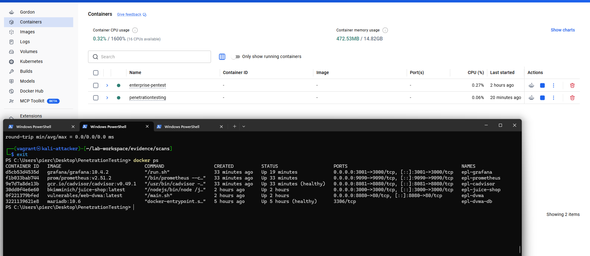
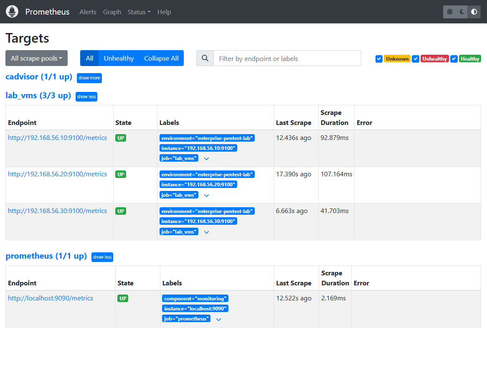
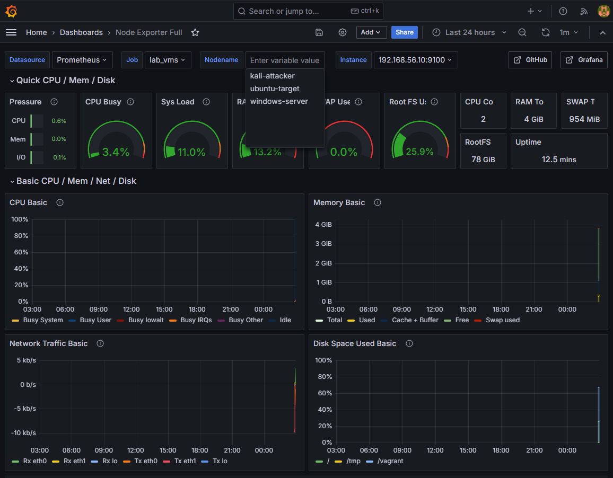
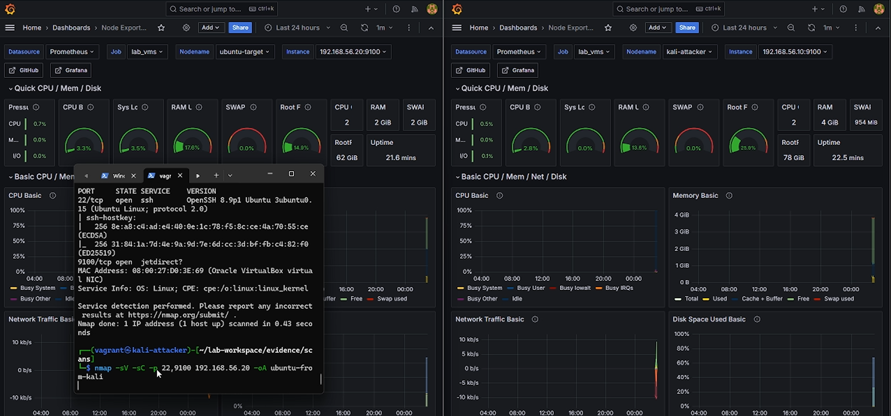
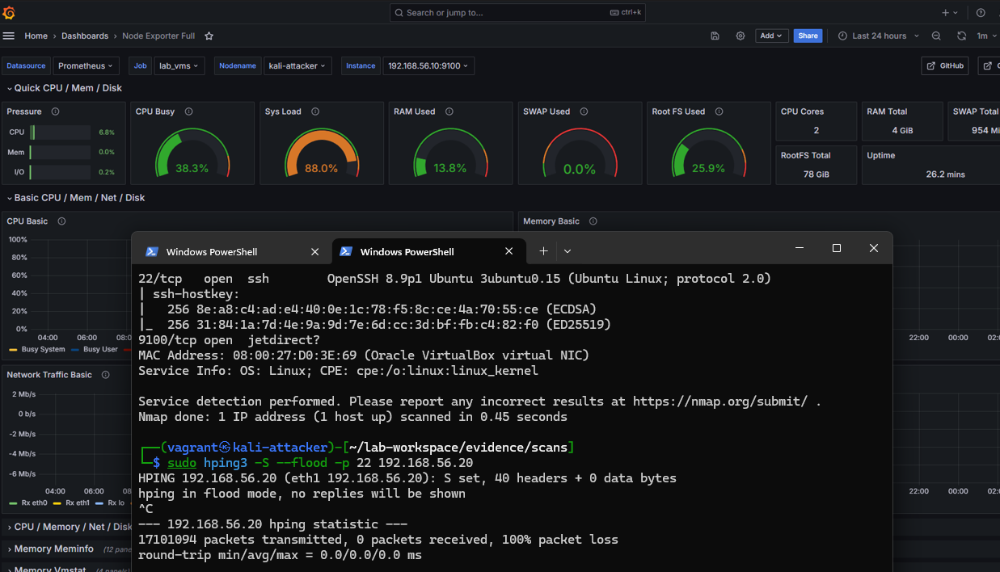

# Automated Enterprise Pentest Lab

Isolated home lab for ethical offensive security practice: three VMs on a host-only network, vulnerable web apps in Docker, and a monitoring stack you can demo end to end.

**Stack:** Vagrant · VirtualBox · Docker Compose · Ansible · Bash (PowerShell on Windows)

| | |
|---|---|
| **Network** | `192.168.56.0/24` — no bridged adapters |
| **Scope** | Lab use only — not for production or unauthorized targets |

---

## What’s in the lab

| Role | Host | IP |
|------|------|-----|
| Attacker | `kali-attacker` | `192.168.56.10` |
| Linux target | `ubuntu-target` | `192.168.56.20` |
| Windows placeholder | `windows-server` | `192.168.56.30` |
| Web apps (Docker on host) | DVWA · Juice Shop | `:8080` · `:3000` |
| Monitoring (default on) | Prometheus · Grafana | `:9090` · `:3001` |

**Practice areas:** internal recon, SSH testing, Linux privesc misconfigs, DVWA/Juice Shop, Prometheus/Grafana with `node_exporter` on each VM.

Deep dives: [architecture](docs/architecture.md) · [testing guide](docs/testing-guide.md) · [security boundaries](docs/security-boundaries.md)

---

## Quick start

**Requirements:** VirtualBox 7.x, Vagrant 2.4+, Docker Compose v2, ~16 GB RAM (8 GB minimum if you run fewer services). On Windows, use Git Bash for shell scripts or `setup.ps1` in PowerShell.

```bash
git clone https://github.com/PMooney03/automated-enterprise-pentest-practice.git
cd automated-enterprise-pentest-practice
chmod +x setup.sh destroy.sh status.sh validate.sh
./setup.sh
```

```powershell
# Windows
.\setup.ps1
```

```bash
./validate.sh    # health checks
./status.sh      # VMs, Docker, gateway IP
vagrant ssh kali-attacker
```

Monitoring is on by default (`ENABLE_MONITORING=true`). Tear down: `./destroy.sh`

| Variable | Purpose |
|----------|---------|
| `ENABLE_MONITORING` | Prometheus + Grafana + cAdvisor |
| `SKIP_VAGRANT` | Docker-only mode |
| `ENABLE_WINDOWS_VM` | Full Windows Server eval (large download) |

See [env.example](env.example) for overrides. Host gateway IP is auto-detected (often `192.168.56.1` or `192.168.56.254`).

---

## Access (lab credentials)

| Service | URL | Login |
|---------|-----|--------|
| DVWA | http://127.0.0.1:8080/ | `admin` / `password` |
| Juice Shop | http://127.0.0.1:3000/ | Register in app |
| Grafana | http://127.0.0.1:3001/ (import **Node Exporter Full** or **Lab VM Metrics**) | `admin` / `labadmin` |
| Ubuntu SSH | `ssh labuser@192.168.56.20` | `labuser123` |
| Kali SSH | `ssh vagrant@192.168.56.10` | `vagrant` |

From VMs, reach Docker apps via the host gateway: `http://<gateway>:8080` (run `./status.sh` to see your gateway).

---

## How it fits together

```
                [ Lab Host ]
+------------------------------------------+
|  Docker: DVWA, Juice Shop, Prometheus,   |
|         Grafana (ports mapped)           |
+-------------------+----------------------+
        |           |         |
  +-----+-----------+---------+-----+
  |         Host-only Network        |
  |        (192.168.56.0/24)        |
  +---------+-----+-----+-----------+
            |     |     |
         [Kali] [Ubuntu] [Windows]
         (.10)   (.20)    (.30)

- Lab Host runs Docker containers for web apps and monitoring.
- VMs (Kali, Ubuntu, Windows) are isolated but can access web apps & monitoring GUIs via host-only network.
- Prometheus (host) monitors VMs.
- To reach apps from a VM: http://<host-gateway>:PORT (see `./status.sh` for gateway IP).
```

**Summary:**
- **Lab Host:** Runs everything (VMs + web apps + monitoring).
- **VMs:** Isolated playground clients/targets.
- **Network:** VMs talk to each other & to Docker apps through the host.

`setup.sh` → Docker web apps → `vagrant up` → Ansible (`ansible_local`) → monitoring stack (Prometheus/Grafana).

---

## Screenshots

What a full lab session looks like after `./setup.sh`: stack up, metrics healthy, recon from Kali, then a lab-only stress exercise against the Ubuntu target.

<p align="center">
  
  
</p>

<p align="center">
  <em>Left: Docker stack (DVWA, Juice Shop, monitoring). Right: Prometheus — <code>lab_vms</code> 3/3 up.</em>
</p>

<p align="center">
  
  
</p>

<p align="center">
  <em>Left: Grafana baseline. Right: <code>nmap -sV -sC</code> from <code>kali-attacker</code> against <code>192.168.56.20</code> (SSH + node_exporter)—target and attacker metrics in Grafana.</em>
</p>

<p align="center">
  
</p>

<p align="center">
  <em><code>hping3</code> SYN flood on port 22 (lab-only availability test). Run briefly; high load on the attacker shows in Grafana—stop with <code>Ctrl+C</code>.</em>
</p>

---

## Repo layout

```
├── Vagrantfile          # 3 VMs, host-only network
├── docker-compose.yml   # DVWA, Juice Shop, monitoring profile
├── setup.sh / setup.ps1
├── ansible/             # Roles: kali, ubuntu_target, node_exporter, …
├── docker/              # Prometheus & Grafana config
└── docs/                # Guides + docs/images/
```

| Doc | Topic |
|-----|--------|
| [architecture.md](docs/architecture.md) | System design |
| [provisioning.md](docs/provisioning.md) | Vagrant & Ansible |
| [networking.md](docs/networking.md) | Segmentation & IPs |
| [testing-guide.md](docs/testing-guide.md) | Lab-only exercises |
| [troubleshooting.md](docs/troubleshooting.md) | Common fixes |

---

## Disclaimer

For **authorized, isolated practice only**. Weak passwords and misconfigurations are intentional inside this network. Do not point these techniques at systems you do not own or lack written permission to test.

---

## Roadmap

- [ ] Full Active Directory DC role
- [ ] Windows provisioning over WinRM
- [ ] CI for Ansible lint / `vagrant validate`
