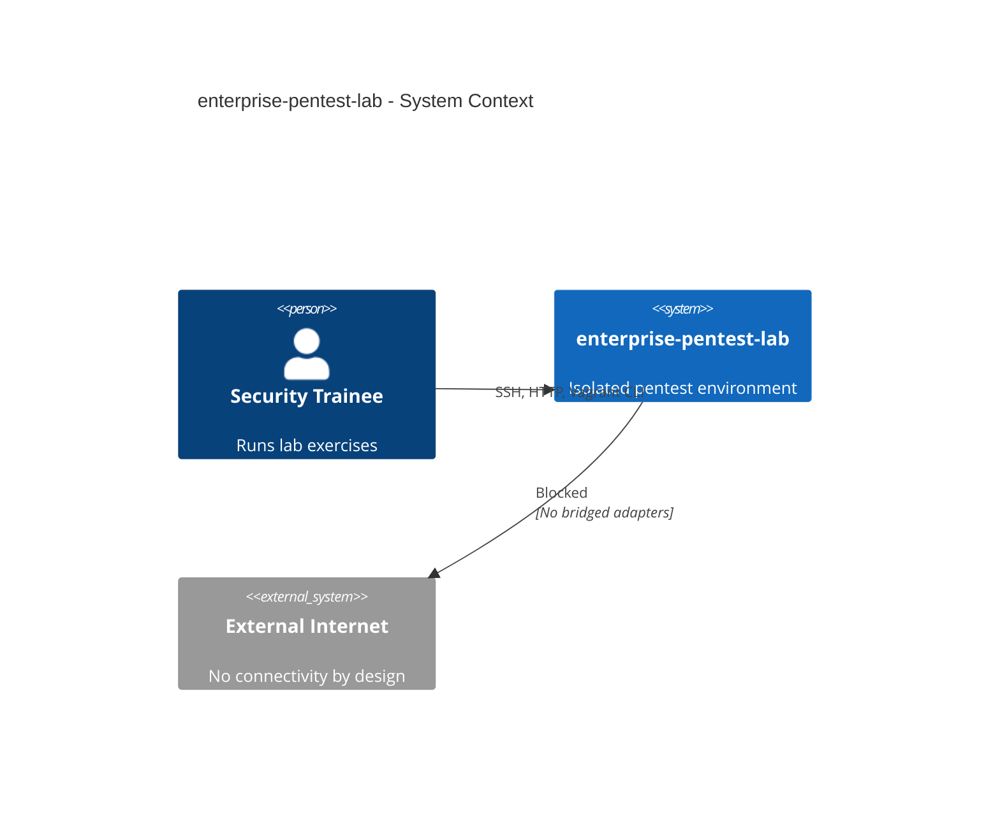
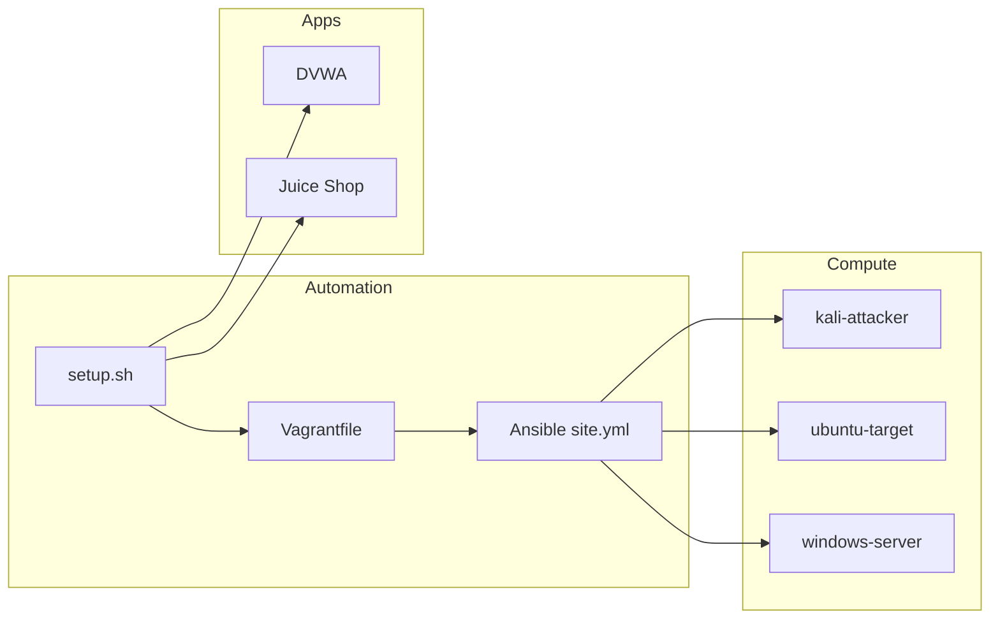
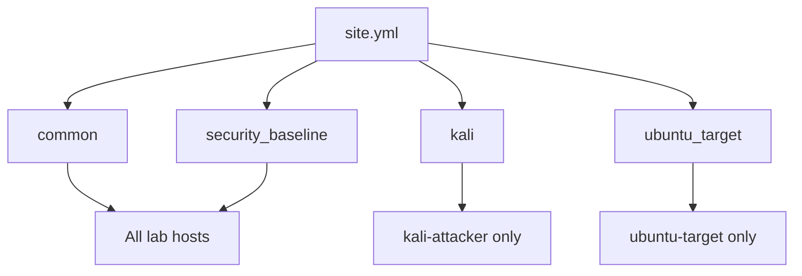

# Architecture

## Design Philosophy

**enterprise-pentest-lab** follows infrastructure-as-code (IaC) principles to deliver a reproducible, modular, and isolated training environment. Each layer is independently maintainable:

| Layer | Technology | Responsibility |
|-------|------------|----------------|
| Orchestration | Bash (`setup.sh`, etc.) | Lifecycle management |
| Virtualization | Vagrant + VirtualBox | VM provisioning |
| Configuration | Ansible | Idempotent system hardening and misconfiguration |
| Applications | Docker Compose | Vulnerable web stacks |
| Observability | Prometheus + Grafana | Optional metrics (profile: `monitoring`) |

## System Context

## Component Architecture

## VM Roles

### kali-attacker

- **Box:** `kalilinux/rolling`
- **Resources:** 4 GB RAM, 2 vCPU
- **Ansible role:** `kali`
- **Purpose:** Network discovery, scanning, web assessment against lab targets

### ubuntu-target

- **Box:** `generic/ubuntu2204`
- **Resources:** 2 GB RAM, 2 vCPU
- **Ansible role:** `ubuntu_target`
- **Purpose:** SSH enumeration, weak configurations, SUID/sudo privesc practice

### windows-server

- **Default:** Linux placeholder (`generic/ubuntu2204`) at 192.168.56.30
- **Optional:** `ENABLE_WINDOWS_VM=true` → Windows Server 2022 eval
- **Purpose:** Structural slot for future Active Directory expansion

## Ansible Role Map

## Docker Services

Docker runs on the **lab host**, not inside VMs. Containers bind to:

- `127.0.0.1` — host-local access
- `192.168.56.1` — VirtualBox host-only gateway (reachable from VMs)

This design keeps vulnerable applications centralized while allowing the Kali VM to attack them across the host-only network.

## Data Flow (Typical Exercise)

1. Operator runs `./setup.sh`
2. VMs receive Ansible configuration
3. Trainee SSHs to `kali-attacker`
4. Scans `192.168.56.0/24` (lab scope only)
5. Enumerates `ubuntu-target` and web apps on `192.168.56.1`
6. Documents findings in `/root/lab-workspace/evidence/`

## Modularity & Extension Points

| Extension | Location |
|-----------|----------|
| New VM | `Vagrantfile` + `ansible/inventory.ini` |
| New role | `ansible/roles/<name>/` |
| AD domain | `ENABLE_WINDOWS_VM` + future `roles/ad_dc` |
| New web app | `docker-compose.yml` |
| CI validation | `.github/workflows/` (future) |

## Non-Goals

- Cloud deployment (by default)
- Internet egress from targets
- Malware, C2 frameworks, or credential harvesting tooling
- Production security hardening (targets are intentionally weak)
