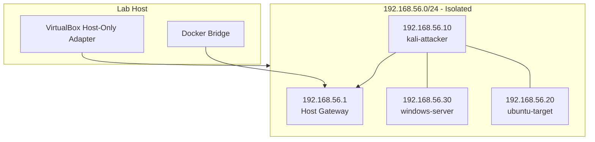

# Networking

## Network Topology

The lab uses VirtualBox **host-only** (private) networking exclusively. No **bridged** or **NAT-only attack paths** to external networks are configured in the Vagrantfile.



## IP Address Plan

| Host | IP | Interface | Notes |
|------|-----|-----------|-------|
| Host gateway | 192.168.56.1 | vboxnet0 | Docker service binding |
| kali-attacker | 192.168.56.10 | eth1 (private) | Attacker workstation |
| ubuntu-target | 192.168.56.20 | eth1 (private) | Linux target |
| windows-server | 192.168.56.30 | eth1 (private) | AD placeholder |

## Segmentation Properties

| Property | Value |
|----------|-------|
| CIDR | 192.168.56.0/24 |
| External exposure | None (by design) |
| Bridged adapters | Disabled |
| DNS | Static `/etc/hosts` entries via Ansible |
| Routing | No intentional path to internet from lab VLAN |

## Vagrant Network Configuration

Each VM defines a single private network:

```ruby
kali.vm.network "private_network", ip: "192.168.56.10"
```

VirtualBox creates or uses `vboxnet0` with address `192.168.56.1/24`.

## Docker Port Binding

Services bind to both localhost and the host-only gateway:

```yaml
ports:
  - "127.0.0.1:8080:80"
  - "192.168.56.1:8080:80"
```

From `kali-attacker`:

```bash
curl -I http://192.168.56.1:8080/
curl -I http://192.168.56.1:3000/
```

## Connectivity Validation

| Script | Check |
|--------|-------|
| `validate.sh` | ICMP, SSH port, HTTP from host |
| `lab-validate-connectivity` (on Kali) | Ping lab hosts + HTTP to Docker |

## Firewall Considerations

- Host firewall may block `192.168.56.1` bindings on Windows — allow Docker Desktop through firewall
- Guest UFW is **disabled by default** (`security_enable_host_firewall: false`)
- IP forwarding disabled via `security_baseline` role

## Troubleshooting Network Issues

See [troubleshooting.md](troubleshooting.md) for:

- vboxnet adapter missing
- Docker unreachable from VMs
- Duplicate IP conflicts
