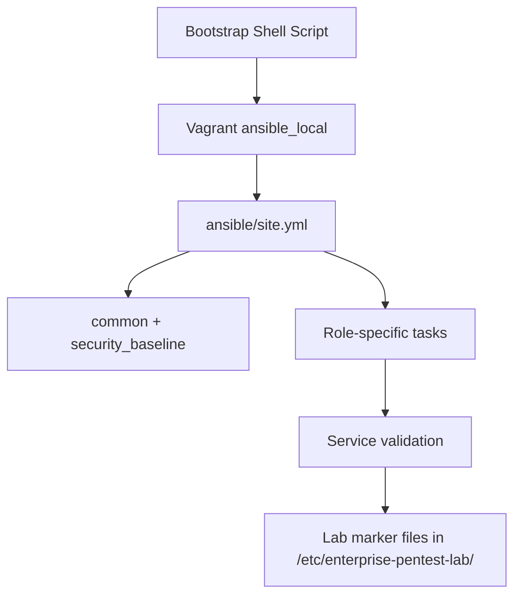

# Provisioning

## Provisioning Pipeline



## Vagrant Provisioning Order

1. **Box download** — first run only (Kali box is large)
2. **bootstrap.sh** — installs Python, Ansible, SSH on Debian-family guests
3. **ansible_local** — runs `site.yml` with host limit per VM

Per-VM limits in `Vagrantfile`:

| VM | Ansible limit |
|----|---------------|
| kali-attacker | `kali` |
| ubuntu-target | `ubuntu_target` |
| windows-server | `windows_server` |

## Ansible Structure

Two inventory files serve different contexts:

| File | Used by | Connection |
|------|---------|------------|
| `inventory.ini` | Host-side `ansible-playbook`, validation | SSH to lab IPs |
| `inventory.vagrant.local.ini` | Vagrant `ansible_local` inside each VM | `local` (127.0.0.1) |

```
ansible/
├── ansible.cfg
├── inventory.ini
├── site.yml
├── group_vars/
│   ├── all.yml
│   ├── kali.yml
│   ├── ubuntu_target.yml
│   └── windows_server.yml
└── roles/
    ├── common/
    ├── kali/
    ├── ubuntu_target/
    └── security_baseline/
```

## Running Ansible Manually

From the project root (after VMs are up):

```bash
# Full lab
ansible-playbook -i ansible/inventory.ini ansible/site.yml

# Single group
ansible-playbook -i ansible/inventory.ini ansible/site.yml --limit ubuntu_target

# Tags
ansible-playbook -i ansible/inventory.ini ansible/site.yml --tags kali
```

## Idempotency

All roles use Ansible modules with `state: present` semantics. Re-running playbooks:

- Does not duplicate users
- Updates configuration only when drift detected
- Safe to run during lab refresh

## Variable-Driven Configuration

Key variables in `group_vars/`:

| Variable | File | Purpose |
|----------|------|---------|
| `practice_users` | `ubuntu_target.yml` | Weak lab accounts |
| `kali_tooling_packages` | `kali.yml` | Scanner tooling |
| `docker_host_ip` | `all.yml` | Web app gateway |
| `lab_isolated` | `all.yml` | Safety marker |

## Docker Provisioning

Docker is **not** managed by Ansible in the default pipeline. `setup.sh` invokes:

```bash
docker compose -f docker-compose.yml up -d dvwa juice-shop
```

Monitoring (enabled by default after VM provisioning):

1. Ansible installs **node_exporter** on all lab VMs (port 9100)
2. Setup starts **cAdvisor**, **Prometheus**, and **Grafana**:

```bash
docker compose --profile monitoring up -d cadvisor prometheus grafana
```

Or full setup: `ENABLE_MONITORING=true ./setup.sh`

Verify targets: http://127.0.0.1:9090/targets (expect `lab_vms` and `cadvisor` UP)

Grafana dashboards (auto-provisioned under folder **Lab Monitoring**):

| Dashboard | Purpose |
|-----------|---------|
| **Lab VM Metrics (Detailed)** | CPU, memory, disk, network, load per VM (`node_exporter`) |
| **Enterprise Pentest Lab Overview** | Quick UP/health summary |

After changing dashboard JSON, reload Grafana:

```bash
docker compose --profile monitoring restart grafana
```

## Windows Server Expansion

### Placeholder mode (default)

- Ubuntu box with hostname `windows-server`
- Marker file: `/etc/enterprise-pentest-lab/ad-placeholder.conf`

### Full Windows mode

```bash
export ENABLE_WINDOWS_VM=true
vagrant up windows-server
```

Future work: Ansible WinRM roles for AD DS, DNS, and certificate services.

## Provisioning Artifacts

| Artifact | Location |
|----------|----------|
| Lab identity | `/etc/enterprise-pentest-lab/identity.conf` |
| Bootstrap timestamp | `/etc/enterprise-pentest-lab/bootstrap-timestamp` |
| Target reference | `/root/lab-targets.txt` (Kali) |
| Lab summary | `./lab-summary.txt` (host) |
| Logs | `./logs/` |

## Refresh Workflow

```bash
# Re-apply Ansible without destroying VMs
vagrant provision

# Or from host
ansible-playbook -i ansible/inventory.ini ansible/site.yml

# Full rebuild
./destroy.sh
./setup.sh
```
