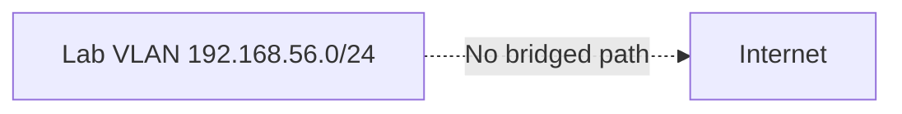

# Security Boundaries

## Purpose

This document defines the **authorized scope**, **technical controls**, and **prohibited activities** for **enterprise-pentest-lab**. It exists to ensure ethical use for training and research.

---

## Authorized Scope

| In Scope | Out of Scope |
|----------|--------------|
| 192.168.56.0/24 lab network | Internet hosts |
| Lab VMs and Docker services | Corporate/production networks |
| Your lab host (localhost bindings) | Third-party SaaS applications |
| Documentation exercises | Unauthorized systems |

---

## Technical Controls

### Network Isolation

- Vagrant `private_network` only — no bridged adapters in `Vagrantfile`
- Docker binds to `127.0.0.1` and `192.168.56.1` — not `0.0.0.0` on public interfaces
- `security_baseline` role disables IP forwarding on Linux guests

### MOTD / Scope Notice

All Linux guests display an isolated training MOTD via Ansible.

### Lab Markers

Configuration files under `/etc/enterprise-pentest-lab/` identify managed hosts and provisioning timestamps.

---

## Permitted Activities

| Category | Examples |
|----------|----------|
| Reconnaissance | nmap, ping, service version detection (lab IPs) |
| Web testing | DVWA, Juice Shop challenges |
| Authentication testing | Weak lab passwords, hydra against lab SSH |
| Privilege escalation | SUID/sudo practice on ubuntu-target |
| Documentation | Reports, screenshots, evidence collection |
| Defensive analysis | Log review, control recommendations |

---

## Prohibited Activities

The following are **explicitly excluded** from this project and must not be introduced:

| Prohibited | Reason |
|------------|--------|
| Scanning public IP ranges | Legal and ethical violation |
| Malware / ransomware samples | Safety and legal risk |
| Credential theft from real users | Harmful and illegal |
| Persistence mechanisms (backdoors, implants) | Not training-appropriate |
| C2 frameworks against external infrastructure | Unauthorized access risk |
| Evasion tooling against enterprise defenses | Misuse potential |
| Destructive payloads (`rm -rf /`, disk wipers) | Data destruction |
| Exfiltration to external servers | Data leakage |

---

## Weak Configurations Disclaimer

The `ubuntu-target` role intentionally deploys:

- Password-authenticated SSH
- Predictable user passwords
- SUID practice binaries
- Permissive directory permissions

These exist **only** on the isolated lab network. **Never** deploy these configurations to production.

---

## Operator Responsibilities

1. Run the lab only on systems you control
2. Do not port-forward lab services to the public internet
3. Destroy the lab when not in use: `./destroy.sh`
4. Keep VirtualBox and Docker updated for host security
5. Comply with local laws and organizational policies

---

## Incident Response (Lab)

If lab traffic accidentally reaches non-lab networks:

1. Run `./destroy.sh` immediately
2. Disconnect host from network
3. Review VirtualBox adapter configuration
4. Audit host firewall rules

---

## Future AD Expansion Safety

When enabling `ENABLE_WINDOWS_VM=true`:

- Keep VM on host-only network
- Do not join production domains
- Use evaluation licenses only
- Snapshot before domain controller experiments

---

## Compliance Mapping (Training Context)

| Control | Lab Implementation |
|---------|-------------------|
| Network segmentation | Host-only 192.168.56.0/24 |
| Least privilege | Documented weak configs for training only |
| Logging | SSH auth logs, optional Prometheus |
| Change management | IaC via Vagrant/Ansible |

This lab is **not** certified for compliance frameworks; it demonstrates security engineering concepts for educational purposes.
