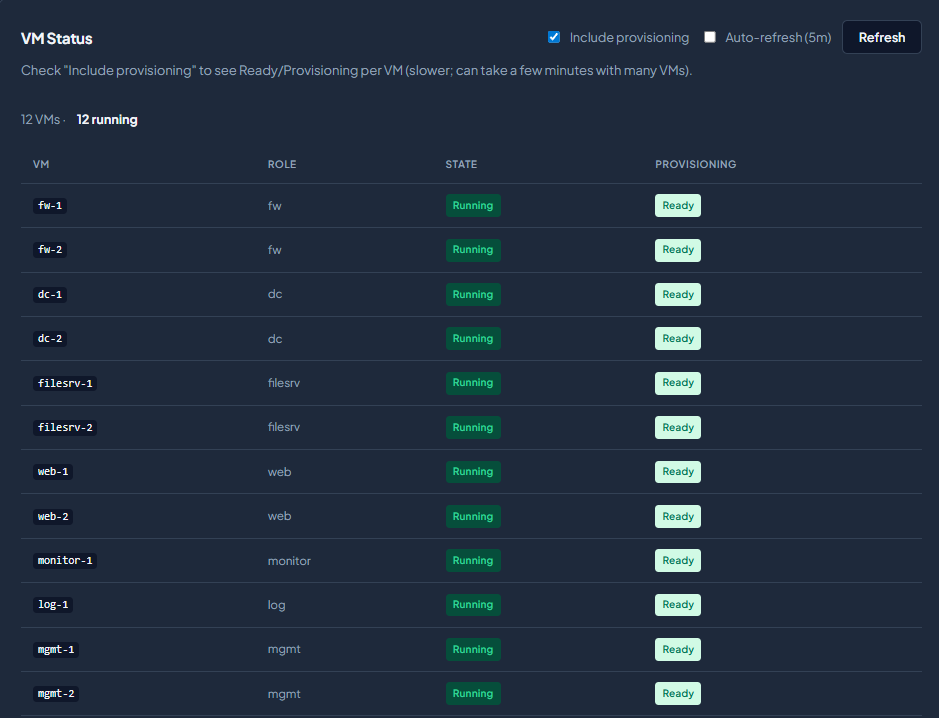
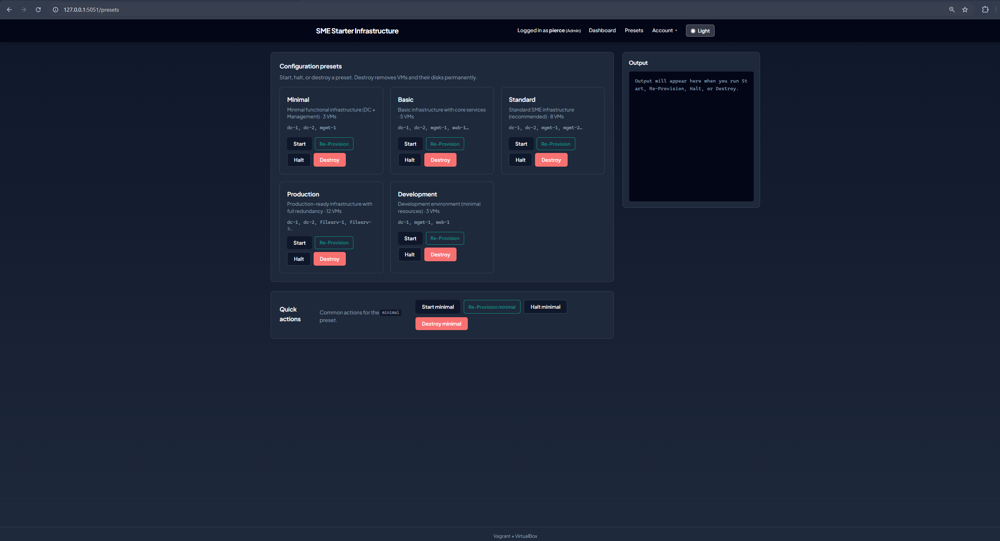
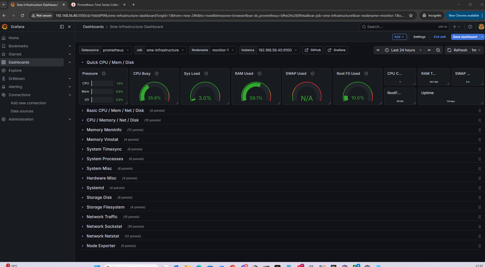
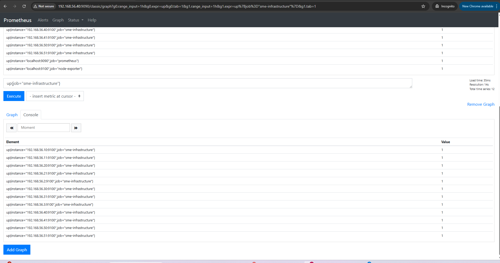

# SME Automated Virtual Infrastructure

Automated SME lab infrastructure (Vagrant, Ansible, monitoring, logging) with an optional **local AI support agent** to help you **set up**, **deploy**, and **troubleshoot** the environment.

---

## What you get

- **Repeatable VM lab** — domain controllers, web, file, mgmt, monitoring, and logging hosts on `192.168.56.0/24`
- **One CLI** — `python cli.py` for bring-up, deploy, status, recovery, and GUI
- **AI support agent (optional)** — documentation Q&A, guided first run, and log analysis using **Ollama** (free, local) or any OpenAI-compatible API

The AI does **not** change your infrastructure automatically. It **advises** and **explains**; you run the commands.

---

## Quick start (recommended — with AI setup help)

### 1. Prerequisites

Install **Python 3.7+**, **VirtualBox**, and **Vagrant**. From the project root:

```powershell
# Windows
.\setup_venv.ps1
.\venv\Scripts\Activate.ps1
pip install -e .
```

```bash
# Linux / macOS
./setup_venv.sh && source venv/bin/activate
pip install -e .
```

### 2. Optional — free local AI (Ollama)

Install [Ollama](https://ollama.com), pull a model, then in **PowerShell**:

```powershell
ollama pull llama3.2

$env:OPENAI_API_KEY = "ollama"
$env:OPENAI_BASE_URL = "http://localhost:11434/v1"
$env:OPENAI_MODEL = "llama3.2"
```

No paid API key required for local use.

### 3. Guided setup (AI-aware walkthrough)

```bash
python cli.py start
```

Or skip the menu:

```bash
python cli.py start --preset minimal
```

This checks prerequisites, explains presets, shows exact commands, and mentions how to use AI after bring-up. To **run the guide and start VMs in one step**:

```bash
python cli.py start --preset minimal --run-up
```

### 4. Bring up VMs (if you did not use `--run-up`)

| Preset | VMs | When to use |
|--------|-----|-------------|
| **minimal** | dc-1, dc-2, mgmt-1 | First lab run (~3 GB RAM) |
| **basic** | minimal + web-1, web-2 | Web services included |
| **standard** | core + filesrv, monitor | Recommended demo |
| **production** | full topology | Full stack (~12 GB RAM) |

```bash
python cli.py up --preset minimal
```

**Windows:** if Vagrant asks which network to bridge, pick your main **Ethernet/Wi-Fi** adapter (e.g. Realtek), not VPN or Hyper-V.

CLI output is saved under `logs/vagrant/` for later AI analysis.

### 5. Wait, then deploy

```bash
python cli.py status --provisioning
python cli.py deploy
```

On Windows, `deploy` runs Ansible inside **mgmt-1** — you stay on the host machine.

### 6. Ask the AI or fix problems

```bash
# Documentation Q&A (answers from README + docs, with sources)
python cli.py ask "How do I deploy the basic environment?"
python cli.py ask "What does dc-1 do?"
python cli.py ask -i

# After a failed or unclear bring-up
python cli.py ai-log --latest
python cli.py ai-log --host-debug dc-1
```

Test checklist: [ai_assistant/evaluation_questions.md](ai_assistant/evaluation_questions.md)

### 7. GUI (optional)

```bash
python cli.py gui
```

Open `http://127.0.0.1:5051` — default login `admin` / `admin`.

---

## Deploy the basic environment (reference)

Exact sequence the support agent should describe:

```bash
python cli.py up --preset basic
python cli.py status --provisioning
python cli.py deploy
```

Same flow with **minimal** if you only need DCs + management:

```bash
python cli.py up --preset minimal
python cli.py status --provisioning
python cli.py deploy
```

---

## SME Infrastructure AI Support Agent

Three ways the AI helps — all optional, all local-friendly with Ollama:

| Mode | Command | Purpose |
|------|---------|---------|
| **Setup guide** | `python cli.py start` | First-run walkthrough: presets, commands, Ollama tips |
| **Documentation Q&A** | `python cli.py ask "..."` | Search project docs → answer + **source files** |
| **Log analysis** | `python cli.py ai-log ...` | Explain Vagrant/provision errors; suggest fixes |

### How it works (no model training)

1. **Setup / ask** — relevant text is taken from README and `docs/` (keyword search), then sent to the LLM with your question.
2. **Bring-up logs** — `python cli.py up` saves a session log; `ai-log --latest` analyses it.
3. **VM logs** — `ai-log --host-debug dc-1` reads provision/syslog output over SSH.

The model is **not** fine-tuned on your machine. Each request is a fresh analysis with project context.

### Safety

- Advisory only — no automatic command execution
- Verify answers against docs and `vagrant status`
- Local models may return imperfect JSON on log analysis; fallbacks are documented in [ai_assistant/README.md](ai_assistant/README.md)

### AI environment variables

| Variable | Local Ollama example |
|----------|----------------------|
| `OPENAI_API_KEY` | `ollama` (any non-empty placeholder) |
| `OPENAI_BASE_URL` | `http://localhost:11434/v1` |
| `OPENAI_MODEL` | `llama3.2` |

For OpenAI’s cloud API, use a real `sk-...` key and `https://api.openai.com/v1`.

### AI command reference

```bash
python cli.py start [--preset minimal] [--run-up]
python cli.py ask "How do I check if Ansible completed successfully?"
python cli.py ask -i
python cli.py ai-log ai_assistant/examples/sample_setup_error.log
python cli.py ai-log --latest
python cli.py ai-log --host-debug dc-1
python cli.py ai-alert ai_assistant/examples/sample_prometheus_alert.json
```

Console aliases after `pip install -e .`: `sme-ask`, `sme-ai-log`, `sme-ai-alert`.

---

## Features

- Automated VM provisioning with Vagrant and role bootstrap scripts
- Ansible configuration management (Windows-safe deploy via mgmt-1)
- Prometheus and Grafana on `monitor-1`
- ELK stack logging on `log-1`
- Optional Flask GUI with login and role-based access
- Presets from `minimal` through `production`
- Recovery commands: `status`, `debug`, `reprovision`, `repair-vm`
- **AI support agent:** guided setup, documentation Q&A with sources, log/alert analysis

---

## Tech stack

- Python, Vagrant, VirtualBox, Ansible, Bash, Flask
- Prometheus, Grafana, Elasticsearch, Logstash, Kibana
- **Ollama** (recommended, free local LLM) or OpenAI-compatible API

---

## Architecture

```
                    INTERNET
                        |
                 [ NAT / DHCP ]
                        |
                ----------------
                |              |
             [FW-1]         [FW-2]
                |              |
                ----------------
                        |
             =====================
             SME INTERNAL NETWORK
             192.168.56.0/24
             =====================

        [DC-1]              [DC-2]     192.168.56.10 / .11
        [FILESRV-1/2]       [WEB-1/2]  .20–.21 / .30–.31
        [MGMT-1/2]          [MONITOR-1] .50–.51 / .40
        [LOG-1]                        .41
```

### Host layout

| Role | Hostnames | Host-only IPv4 |
|------|-----------|----------------|
| Firewalls | `fw-1`, `fw-2` | `192.168.56.3`, `192.168.56.2` |
| Domain controllers | `dc-1`, `dc-2` | `192.168.56.10`, `192.168.56.11` |
| File servers | `filesrv-1`, `filesrv-2` | `192.168.56.20`, `192.168.56.21` |
| Web servers | `web-1`, `web-2` | `192.168.56.30`, `192.168.56.31` |
| Monitoring | `monitor-1` | `192.168.56.40` |
| Logging | `log-1` | `192.168.56.41` |
| Management | `mgmt-1`, `mgmt-2` | `192.168.56.50`, `192.168.56.51` |

### Provisioning model

1. **Vagrant** creates and boots VMs.
2. **Bootstrap scripts** in `vagrant/bootstrap/` apply base role setup (logged to `/var/log/vagrant-provision.log` on provision).
3. **Ansible** playbooks apply final configuration, users, and services.

### Screenshots

| Dashboard GUI | Deployment GUI |
|---------------|----------------|
|  |  |

| Grafana | Prometheus |
|---------|------------|
|  |  |

---

## Manual setup (without the AI guide)

If you prefer not to use `python cli.py start`:

```bash
pip install -e .
python cli.py up --preset standard
python cli.py status --provisioning
python cli.py deploy
python cli.py gui
```

Raw Vagrant: `cd vagrant && vagrant up`

---

## Default credentials

| Service | Username | Password |
|---------|----------|----------|
| GUI | `admin` | `admin` |
| Domain Admin | `Administrator` | `Admin123!` |
| Management | `sme-admin` | `Admin123!` |
| Grafana | `admin` | `admin` |
| Vagrant SSH | `vagrant` | `vagrant` |

These are **lab defaults only**. Change passwords and SSH keys before any real deployment. Do not commit `gui/users.json` or API keys (see `.gitignore`).

---

## Access points

| Service | URL |
|---------|-----|
| GUI | http://127.0.0.1:5051 |
| Web | http://192.168.56.30 , http://192.168.56.31 |
| Grafana | http://192.168.56.40:3000 |
| Prometheus | http://192.168.56.40:9090 |
| Kibana | http://192.168.56.41:5601 |

---

## Common commands

```bash
# AI-assisted setup and support
python cli.py start --preset minimal
python cli.py ask "What should I do if the web server is not reachable?"
python cli.py ai-log --latest

# Infrastructure lifecycle
python cli.py up --preset standard
python cli.py status --provisioning
python cli.py deploy
python cli.py poweroff --preset production
python cli.py resume --preset production
python cli.py reprovision --preset production
python cli.py repair-vm mgmt-1
python cli.py debug --host-debug dc-1
python cli.py gui
```

---

## Project status

Finished demonstration project: end-to-end VM lifecycle, preset deployments, monitoring/logging integration, Windows-safe Ansible, optional GUI, and an **AI support agent** for setup guidance, documentation Q&A, and log troubleshooting.

Intended for local demonstration, evaluation, and academic use — not a hardened internet-facing production deployment.

---

## Documentation

| Topic | Link |
|-------|------|
| Detailed setup | [docs/SETUP.md](docs/SETUP.md) |
| Virtual environment | [docs/SETUP_VENV.md](docs/SETUP_VENV.md) |
| Ansible | [docs/ANSIBLE.md](docs/ANSIBLE.md) |
| Identity and access | [docs/IDENTITY_AND_ACCESS.md](docs/IDENTITY_AND_ACCESS.md) |
| Security | [docs/SECURITY.md](docs/SECURITY.md) |
| Debugging | [docs/DEBUGGING.md](docs/DEBUGGING.md) |
| AI assistant detail | [ai_assistant/README.md](ai_assistant/README.md) |
| AI evaluation questions | [ai_assistant/evaluation_questions.md](ai_assistant/evaluation_questions.md) |
| Quick start (short) | [QUICK_START.md](QUICK_START.md) |

---

## License

MIT License. See [LICENSE](LICENSE).
