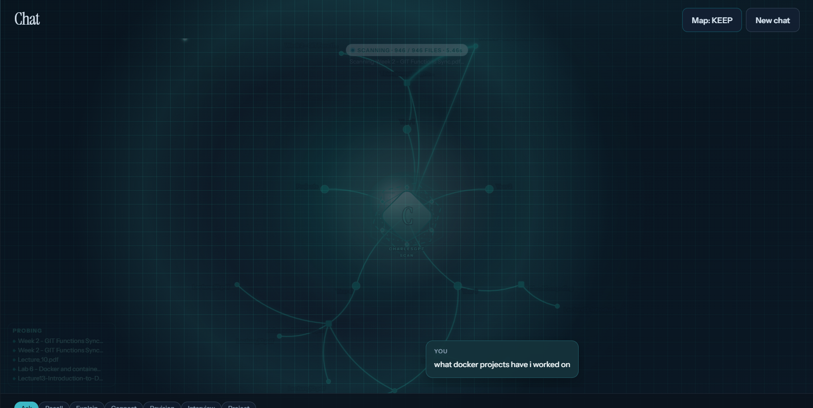
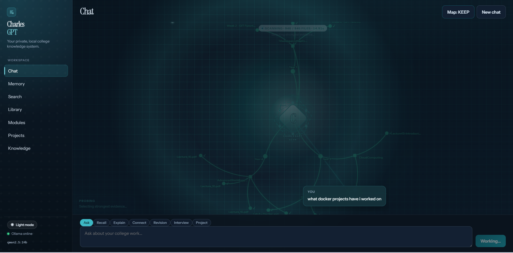

# Pierce-Mooney-Second-Brain

Local RAG over my college archive and portfolio projects — hybrid search, cited answers, live retrieval map, no paid APIs.

Indexes PDFs, Word docs, images (OCR), and source files from `Year1`–`Year4` + `Projects`, retrieves with SQLite FTS5 + Qdrant, and answers through a local Ollama model (`gpt-oss:20b`). The chat UI is branded **CharlesGPT**; this repo is the Second Brain project around it.

Coursework stays on my machine. Real lecture/lab PDFs are gitignored; `Projects/` and `demo_corpus/` are what ship publicly.

---

## Demo

[SecondBrainDemo.mp4](Images/SecondBrainDemo.mp4) (~40MB)

Ask about coursework → watch the retrieval map → read a cited, streaming answer → open a source.

---

## Screenshots

### Chat + live RAG map

Modes (Ask, Recall, Explain, Connect, Revision, Interview, Project). Replies stream, and each answer is tagged **RAG**, **Web search**, or **Model answer**.






### Memory · Search · Library


### Modules · Projects · Knowledge

Clickable cards that drill into documents or project folders.


---

## How it works

```
files → extract/OCR → chunk → embed (Ollama)
              ↓                    ↓
         SQLite + FTS5         Qdrant
              └────────┬─────────┘
                       ↓
              hybrid retrieve → Ollama chat → UI
```

| Piece | Role |
| --- | --- |
| Corpus | `Year*` + `Projects` locally; `demo_corpus/` for clones |
| SQLite | Metadata, FTS5, chat/memory |
| Qdrant | Local vectors |
| Ollama | Embeddings + `gpt-oss:20b` chat |
| FastAPI / React | API + UI |

---

## Stack

- **Backend:** Python, FastAPI  
- **Data:** SQLite (FTS5), embedded Qdrant  
- **Models:** `gpt-oss:20b` (chat), `nomic-embed-text` (embed) via Ollama  
- **Ingest:** PDF, DOCX, images (RapidOCR), code/text  
- **Frontend:** React, TypeScript, Vite  

`gpt-oss:20b` is an open-weight model run locally — stronger long answers than the old `qwen2.5:14b` default, still free and offline. Change models in `backend/.env` (`OLLAMA_CHAT_MODEL` / `OLLAMA_EMBED_MODEL`). Swapping chat models doesn’t need a re-ingest; swapping embed models does.

Binds to `127.0.0.1`. No cloud LLM bills. Optional DuckDuckGo Instant Answer for non-archive questions (`WEB_LOOKUP_ENABLED`). Years and index DBs are gitignored.

---

## Setup

**Need:** Python 3.11+, Node 20+, [Ollama](https://ollama.com/download)

```powershell
cd backend
python -m venv .venv
.\.venv\Scripts\Activate.ps1
pip install -r requirements.txt
copy .env.example .env

ollama pull gpt-oss:20b
ollama pull nomic-embed-text
```

- Your machine: leave `DOCUMENTS_PATH` empty  
- Public clone: `DOCUMENTS_PATH=demo_corpus`

```powershell
.\backend\.venv\Scripts\python scripts\ingest.py

cd backend
.\.venv\Scripts\Activate.ps1
uvicorn app.main:app --host 127.0.0.1 --port 8000 --reload
```

```powershell
cd frontend
npm install
npm run dev
```

UI: http://127.0.0.1:5173 · API: http://127.0.0.1:8000/docs  

Reset indexes only: `.\backend\.venv\Scripts\python scripts\reset_database.py`

---

## Still todo

- PPTX ingest (images/scans already OCR at ingest)  
- Cross-encoder rerank  
- Image attach in the chat UI (ingest already handles image files on disk)
