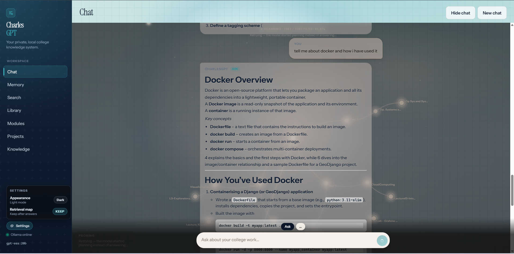
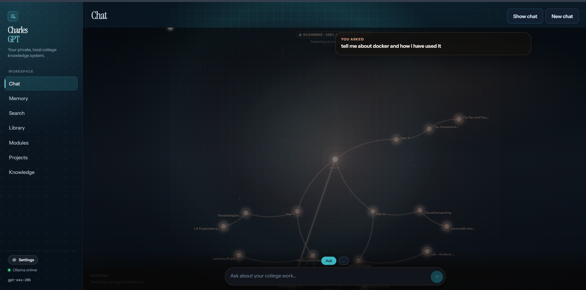
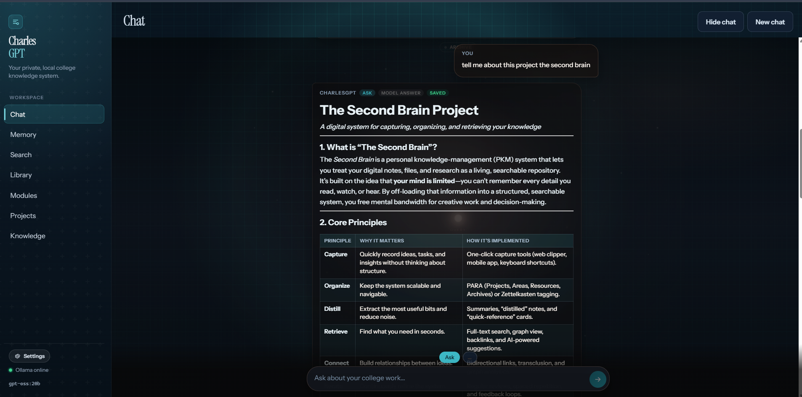
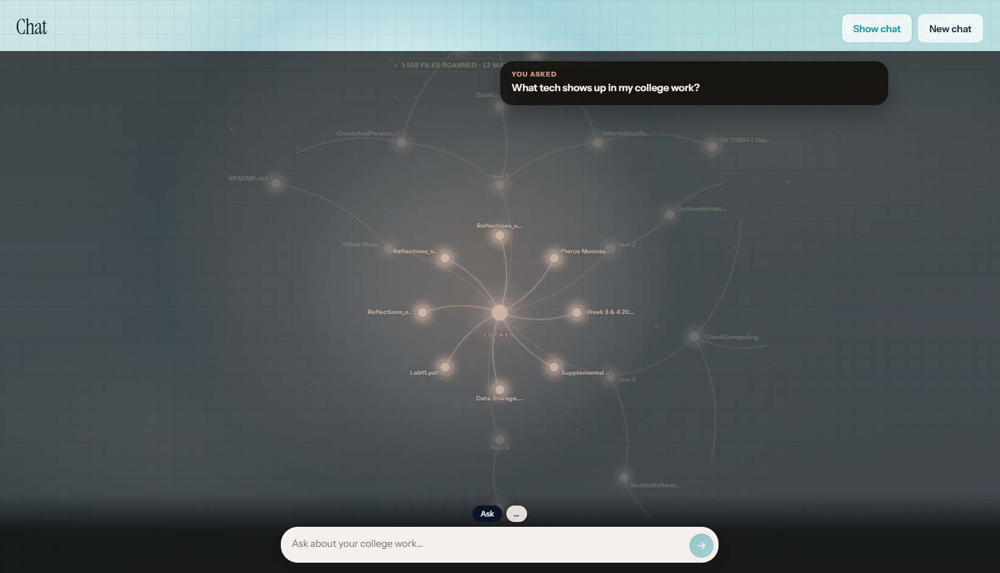
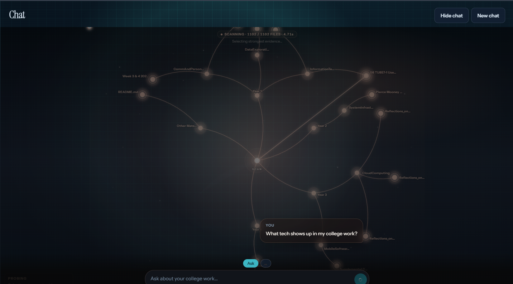
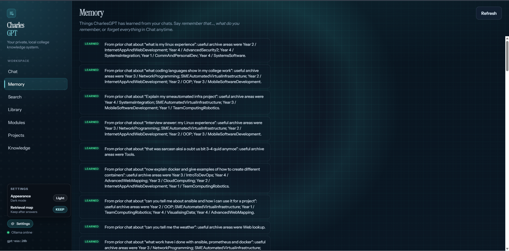

# Pierce-Mooney-Second-Brain

Local RAG over my college archive and portfolio projects — hybrid search, cited answers, live retrieval map, no paid APIs.

Indexes PDFs, Word docs, images (OCR), and source files from `Year1`–`Year4` + `Projects`, retrieves with SQLite FTS5 + Qdrant, and answers through a local Ollama model (`gpt-oss:20b`). The chat UI is branded **CharlesGPT**; this repo is the Second Brain project around it.

Coursework stays on my machine. Real lecture/lab PDFs are gitignored; `Projects/` and `demo_corpus/` are what ship publicly.

---

## Demo

[SecondBrainDemo.mp4](Images/SecondBrainDemo.mp4) (~116MB, Git LFS)

Ask about coursework → watch the retrieval map → read a cited, streaming answer → open a source.

---

## Screenshots

### Chat + live RAG map

Modes (Ask, Recall, Explain, Connect, Revision, Interview, Project). Replies stream, and each answer is tagged **RAG**, **Web search**, or **Model answer**.











### Memory · Library




### Modules · Projects · Knowledge

Clickable cards that drill into documents or project folders.


---

## How it works

```
files → extract/OCR → chunk → embed (Ollama)
              ↓                    ↓
         SQLite + FTS5         Qdrant
              └────────┬─────────┘
                       ↓
              hybrid retrieve → Ollama chat → UI
```

| Piece | Role |
| --- | --- |
| Corpus | `Year*` + `Projects` locally; `demo_corpus/` for clones |
| SQLite | Metadata, FTS5, chat/memory |
| Qdrant | Local vectors |
| Ollama | Embeddings + `gpt-oss:20b` chat |
| FastAPI / React | API + UI |

---

## Stack

- **Backend:** Python, FastAPI  
- **Data:** SQLite (FTS5), embedded Qdrant  
- **Models:** `gpt-oss:20b` (chat), `nomic-embed-text` (embed) via Ollama  
- **Ingest:** PDF, DOCX, PPTX, images (RapidOCR), code/text  
- **Frontend:** React, TypeScript, Vite  

Binds to `127.0.0.1`. No cloud LLM bills. Optional DuckDuckGo Instant Answer for non-archive questions (`WEB_LOOKUP_ENABLED`). Years and index DBs are gitignored.

---

## Ollama models (download + hardware)

Everything runs through the [Ollama](https://ollama.com/download) app on `localhost:11434`. You always need the **embed** model (search/index). The **chat** model is what writes answers — pick it from RAM/VRAM, not from the biggest name on the library page.

Set names in `backend/.env`:

```
OLLAMA_CHAT_MODEL=gpt-oss:20b
OLLAMA_EMBED_MODEL=nomic-embed-text
```

- Changing **chat** only: restart Ollama/backend, no re-ingest.  
- Changing **embed**: pull the new model, then re-run `scripts/ingest.py` (vectors must match).

Sizes below are what `ollama pull` typically downloads. Runtime needs extra RAM/VRAM for context. Ollama will use a GPU if it fits; otherwise it offloads to CPU (slow but works).

### Embed (required)

| Model | Pull | Disk | Memory | Notes |
| --- | --- | --- | --- | --- |
| **`nomic-embed-text`** (default) | `ollama pull nomic-embed-text` | ~274 MB | ~1 GB | Keep this. Fine on any laptop that can run the rest of the stack. |

### Chat (pick one)

| Model | Pull | Disk | Comfortable machine | Notes |
| --- | --- | --- | --- | --- |
| **`llama3.2`** (~3B) | `ollama pull llama3.2` | ~2 GB | 8 GB RAM, any GPU / CPU | Lightest usable chat. Short answers, weaker RAG write-ups. |
| **`llama3.1:8b`** | `ollama pull llama3.1:8b` | ~4.9 GB | 8–12 GB RAM or 8 GB VRAM | Solid small default if 20B is too heavy. |
| **`qwen2.5:7b`** | `ollama pull qwen2.5:7b` | ~4.7 GB | 8–12 GB RAM or 8 GB VRAM | Similar band to 8B; decent instruction following. |
| **`qwen2.5:14b`** | `ollama pull qwen2.5:14b` | ~9 GB | 16 GB RAM or 12 GB VRAM | Previous project default. Good RAG answers without 20B cost. |
| **`gpt-oss:20b`** (repo default) | `ollama pull gpt-oss:20b` | ~14 GB | **16 GB+ VRAM**, or **32 GB RAM** if mostly CPU | OpenAI open-weights (MXFP4). Official floor is ~16 GB memory; 16 GB GPUs are tight. 8 GB / 12 GB cards will offload and feel slow. |
| **`gpt-oss:120b`** | — | ~65–80 GB | Datacenter / 80 GB GPU | Do not pull on a student laptop. |

**Rule of thumb**

- **8 GB RAM laptop:** embed + `llama3.2` or `llama3.1:8b`.  
- **16 GB RAM, weak/no GPU:** embed + `qwen2.5:14b` (or 8B if it swaps). Skip `gpt-oss:20b` unless you accept very slow CPU offload.  
- **16 GB VRAM (e.g. 4070 / 4080-class) or 32 GB unified (M-series / desktop):** embed + `gpt-oss:20b` as in `.env.example`.  
- Keep **~10 GB free disk** for 14B, **~16 GB** for 20B, plus the embed model and Ollama itself.

After pulling, point `.env` at that chat tag and confirm with `ollama list`. The UI health line / `/api/health` shows whether both models are available.

---

## Setup

**Need:** Python 3.11+, Node 20+, [Ollama](https://ollama.com/download)

```powershell
cd backend
python -m venv .venv
.\.venv\Scripts\Activate.ps1
pip install -r requirements.txt
copy .env.example .env

ollama pull nomic-embed-text
ollama pull gpt-oss:20b
```

If 20B will not fit, pull a smaller chat model from the table above and set `OLLAMA_CHAT_MODEL` in `.env` (example: `qwen2.5:14b` or `llama3.1:8b`).

- Your machine: leave `DOCUMENTS_PATH` empty  
- Public clone: `DOCUMENTS_PATH=demo_corpus`

```powershell
.\backend\.venv\Scripts\python scripts\ingest.py

cd backend
.\.venv\Scripts\Activate.ps1
uvicorn app.main:app --host 127.0.0.1 --port 8000 --reload
```

```powershell
cd frontend
npm install
npm run dev
```

UI: http://127.0.0.1:5173 · API: http://127.0.0.1:8000/docs  

Reset indexes only: `.\backend\.venv\Scripts\python scripts\reset_database.py`

---

## Still todo

- PPTX ingest (images/scans already OCR at ingest)  
- Cross-encoder rerank  
- Image attach in the chat UI (ingest already handles image files on disk)
