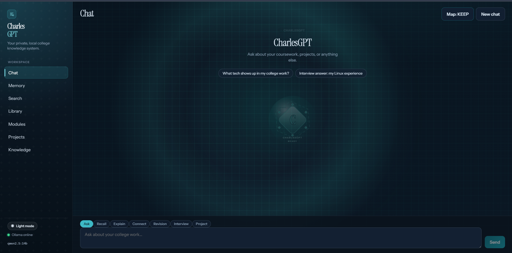
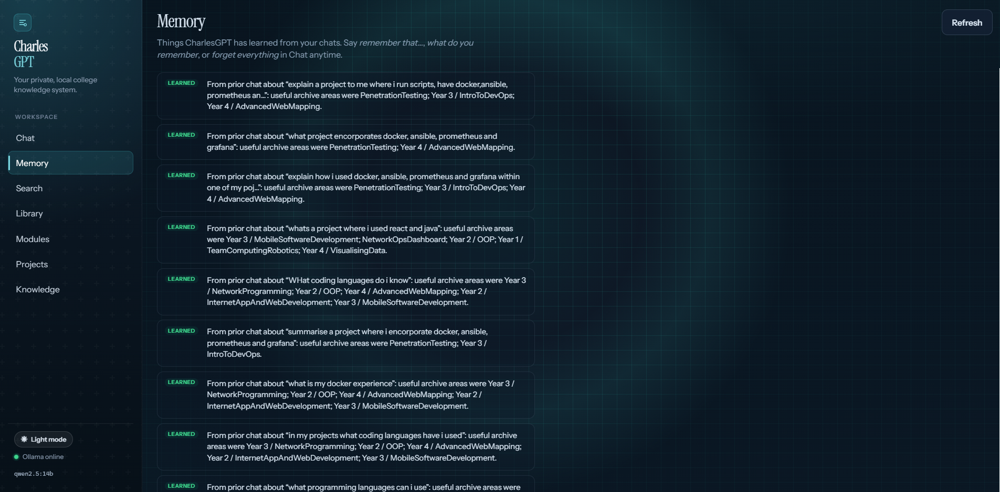
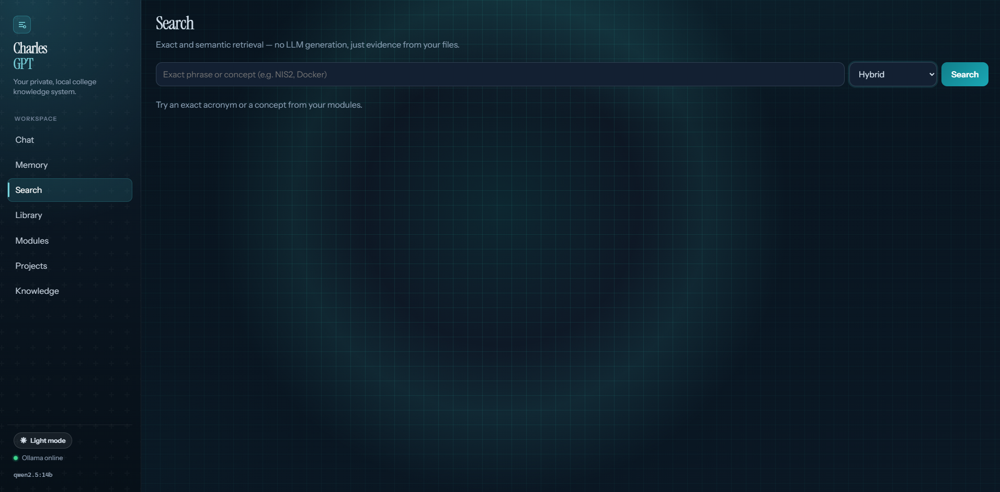
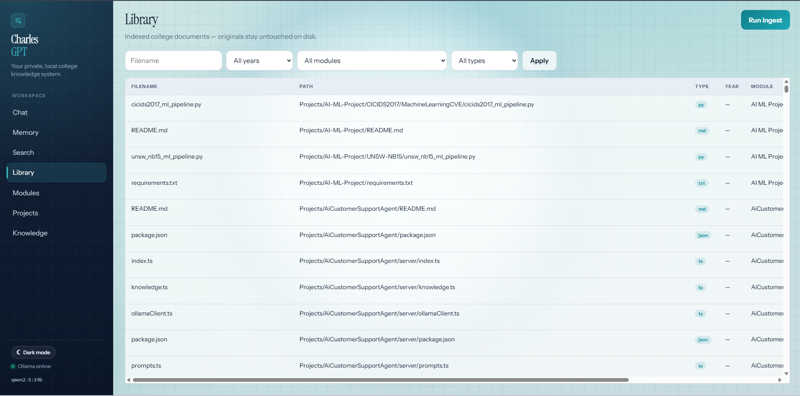
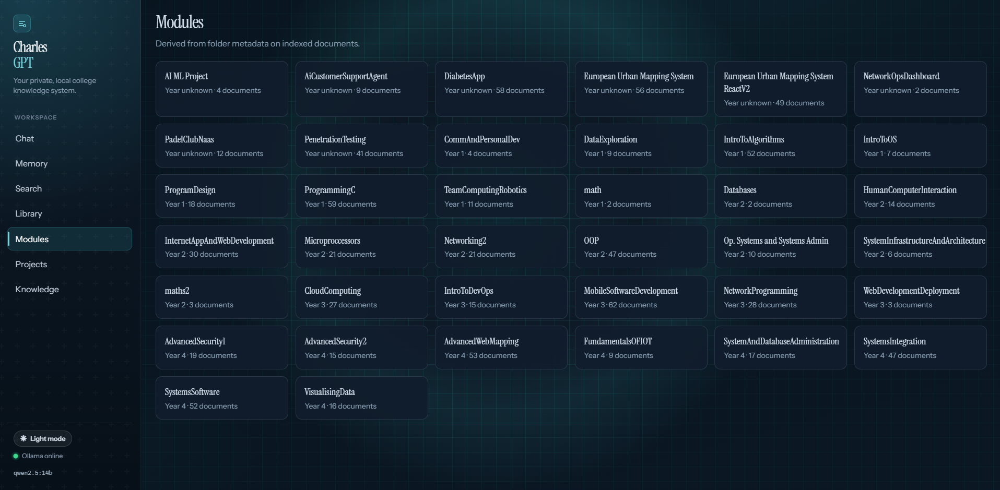
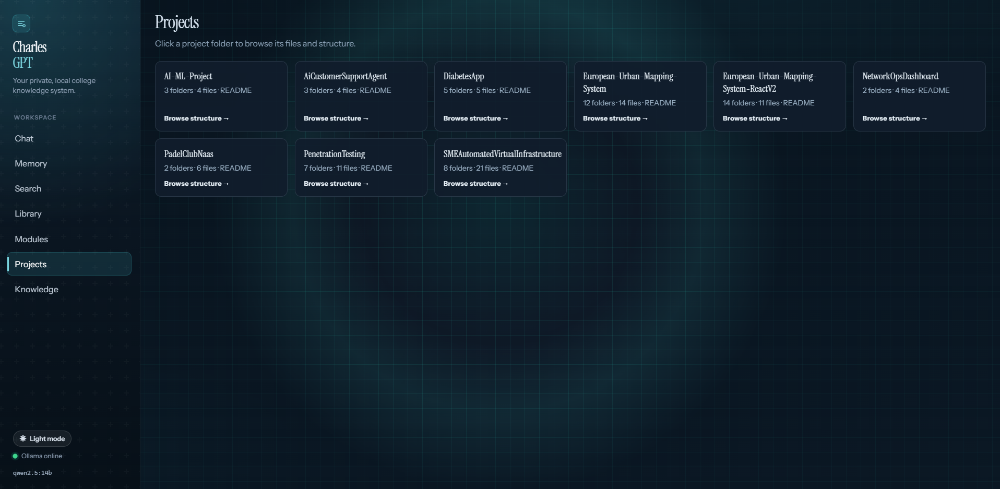
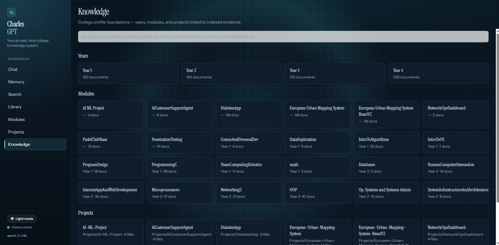

# CharlesGPT

**A fully local RAG system over a real college archive — hybrid retrieval, cited answers, and a live search visualization — with no paid APIs, no cloud bill, and no uploaded coursework.**

CharlesGPT is a private knowledge product for one student’s materials. It indexes PDFs, Word docs, and source files from college years and portfolio projects, retrieves evidence with hybrid search (SQLite FTS5 + local Qdrant), and answers through a local Ollama model while showing *which* files, pages, and sections grounded the reply.

It is local on purpose: **keep it free** (Ollama + open-source stack, no per-token API costs) and **keep it private** (coursework never leaves the machine). Built end-to-end: ingestion pipeline, retrieval stack, FastAPI backend, React UI, and product surfaces for chat, search, library, memory, and project browsing.

---

## What makes it interesting

Most “chat with PDFs” demos stop at a single folder and a hosted API key. CharlesGPT is designed as a **local-first system** over a multi-year corpus — free to run, private by default:

- **Hybrid retrieval** — keyword (FTS5) + semantic (Qdrant) fused for exact phrases *and* vague questions  
- **Grounded answers** — responses cite chunks; the model is not treated as memory  
- **Live retrieval map** — chat shows search expanding through years → modules → files while the answer is forming  
- **Product, not a script** — modes (Ask, Recall, Explain, Connect, Revision, Interview, Project), library ingest, memory, and a `Projects/` file browser  
- **Free to operate** — Ollama + SQLite + embedded Qdrant; no OpenAI/Anthropic bill that grows with every question and ingest  
- **Privacy by architecture** — binds to `127.0.0.1`, indexes stay on disk, college files are never modified or uploaded

That combination — retrieval quality, UX, and deliberately avoiding paid cloud APIs — is the point of the project.

---

## Demo

[Download / play the demo video](Images/CharlesGPTDemo.mp4) (~40MB)

Typical walkthrough: ask something about coursework → watch the retrieval map → read a cited answer → open a source chunk → browse a portfolio project folder.

---

## Product tour

Seven workspace pages. Screenshots below are from a local dark-mode run.

### Chat

Grounded conversation over your archive. Modes (Ask, Recall, Explain, Connect, Revision, Interview, Project) change how answers are framed. While retrieving, a live map shows years → modules → files. Ask mode can also use weather, calc, time, and light web lookup when the question is not coursework.



### Memory

Bank of facts CharlesGPT has learned — explicit “remember that…” notes plus routes learned from prior chats. Manageable from Chat (`what do you remember`, `forget everything`).



### Search

Hybrid / keyword / semantic retrieval **without** LLM generation — just ranked evidence chunks from your files. Useful when you want the source, not a rewritten answer.



### Library

Indexed documents with filters (filename, year, module, type) and **Run ingest** for incremental updates. Originals on disk are never modified.



### Modules

Module cards derived from path metadata on indexed docs — year + document counts across the corpus.



### Projects

Portfolio folders under `Projects/`. Click in to browse structure and preview files (README, code, config) without leaving the app.



### Knowledge

High-level profile: years, modules, and project folders linked to indexed evidence — a snapshot of what the system knows about your archive.



---

## How it works

```
College files (read-only)
        │
        ▼
  extract → chunk → embed (Ollama)
        │              │
        ▼              ▼
   SQLite + FTS5    Qdrant (local)
        │              │
        └──────┬───────┘
               ▼
        hybrid retrieve
               ▼
     Ollama chat + citations
               ▼
         React UI + live map
```


| Layer       | Responsibility                                                         |
| ----------- | ---------------------------------------------------------------------- |
| **Corpus**  | `Year1`–`Year4` + `Projects` locally; `demo_corpus/` for public clones |
| **SQLite**  | Document/chunk metadata, FTS5 keyword search, chat/memory persistence  |
| **Qdrant**  | Embedded vector store for semantic similarity                          |
| **Ollama**  | Embeddings + chat LLM — entirely local                                 |
| **FastAPI** | Ingest, search, chat stream, project browse, health                    |
| **React**   | Product UI over the API                                                |


The LLM answers the turn. **SQLite, Qdrant, and the files** are the long-term knowledge store.

---

## Technical decisions


| Decision                            | Why                                                                                                |
| ----------------------------------- | -------------------------------------------------------------------------------------------------- |
| **Hybrid FTS + vectors**            | Coursework needs both “exact NIS2 quote” and “what did I do with Docker?”                          |
| **Content-hash ingest**             | Skip unchanged files; re-chunk only updates; delete index rows if files leave disk                 |
| **Embedded Qdrant + SQLite**        | Zero cloud deps and zero hosted DB fees; clone → configure → run on one machine                    |
| **Local Ollama only**               | Keeps document text off third-party chat APIs **and** avoids per-token costs for chat + embeddings |
| **Mode-specific prompts**           | Same retrieval stack; different answer contracts (revision vs interview vs project brief)          |
| **Trace-driven UI**                 | Search events drive the map — visualization reflects real retrieval, not decoration                |
| **Gitignore years, track Projects** | Showcase portfolio work without publishing private coursework                                      |


---

## Example user flow

1. Student asks: *“Give me an interview answer about my Linux experience.”*
2. System retrieves relevant labs / project READMEs / notes via hybrid search.
3. Live map highlights years → modules → files as matches land.
4. Model writes a first-person answer grounded in those chunks.
5. Student expands sources to verify the evidence.
6. Optional: open **Projects** and browse the related repo structure on disk.

For non-academic asks (“what’s the weather?”, “remember that I prefer short answers”), Ask mode uses tools/memory instead of forcing the archive.

---

## Tech stack

- **Backend:** Python, FastAPI, Pydantic Settings  
- **Data:** SQLite (FTS5), Qdrant (local embedded)  
- **LLM / embeddings:** Ollama (default chat `qwen2.5:14b`, embed `nomic-embed-text`)  
- **Ingest:** PDF / DOCX / common source & text formats  
- **Frontend:** React, TypeScript, Vite  
- **Runtime:** Windows-friendly local `127.0.0.1` services

---

## Privacy, cost, and local-first design

Local is a product choice, not just a deployment detail:

- **Free to run** — no OpenAI/Anthropic (or similar) subscription that scales with every chat turn and every embedding during ingest; the stack is Ollama + open-source storage on your hardware  
- **Private by default** — server binds to **localhost only**; no telemetry, analytics, or cloud auth  
- Coursework stays on disk; originals are **never written back** by ingest  
- Index DBs and `Year1`–`Year4` are **gitignored** so a public repo does not leak private PDFs  
- Optional DuckDuckGo Instant Answer for lightweight non-archive questions (still no API key) — disable with `WEB_LOOKUP_ENABLED=false`

**On GitHub:** `Projects/` and `demo_corpus/` are safe to ship. Real years stay local. Point a clone at `DOCUMENTS_PATH=demo_corpus` to demo Q&A without private files.

---

## Setup

### Prerequisites

- Python 3.11+  
- Node.js 20+  
- [Ollama](https://ollama.com/download) running locally

### Backend

```powershell
cd backend
python -m venv .venv
.\.venv\Scripts\Activate.ps1
pip install -r requirements.txt
copy .env.example .env
```

```powershell
ollama pull qwen2.5:14b
ollama pull nomic-embed-text
```

### Corpus

- **Your machine:** leave `DOCUMENTS_PATH` empty → indexes `Year`* + `Projects`  
- **Public clone:** set `DOCUMENTS_PATH=demo_corpus` in `backend/.env`

### Ingest + run

```powershell
# repo root — with API running preferred
.\backend\.venv\Scripts\python scripts\ingest.py

cd backend
.\.venv\Scripts\Activate.ps1
uvicorn app.main:app --host 127.0.0.1 --port 8000 --reload
```

```powershell
cd frontend
npm install
npm run dev
```

UI: [http://127.0.0.1:5173](http://127.0.0.1:5173) · API health: [http://127.0.0.1:8000/api/health](http://127.0.0.1:8000/api/health) · OpenAPI: [http://127.0.0.1:8000/docs](http://127.0.0.1:8000/docs)  

Reset indexes only (never deletes college files):

```powershell
.\backend\.venv\Scripts\python scripts\reset_database.py
```

```powershell
cd backend
.\.venv\Scripts\Activate.ps1
pytest -q
```

---

## Limitations / roadmap

**Today**

- PPTX and OCR image text not ingested yet  
- First full ingest is slow on large corpora (per-chunk local embeddings)  
- No cross-encoder reranker (hybrid fusion only)  
- Web enrichment is Instant Answer style, not a browsing agent

**Next**

1. PPTX parser
2. Streaming ingest progress
3. Optional local cross-encoder rerank
4. Richer knowledge graph from evidence (tech/topics with citations)

---

Built as a portfolio system: real retrieval constraints, real local data, deliberately **free to operate**, and a UI that makes the pipeline visible — not a thin wrapper around a paid hosted chat API.